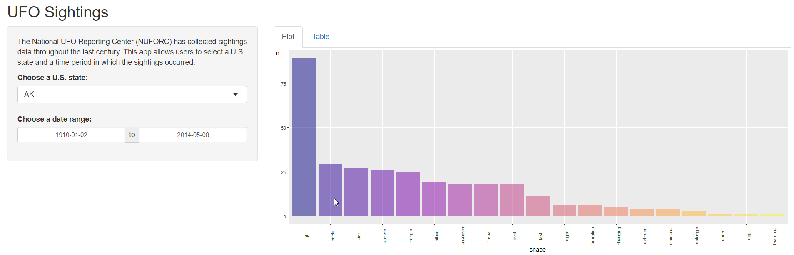
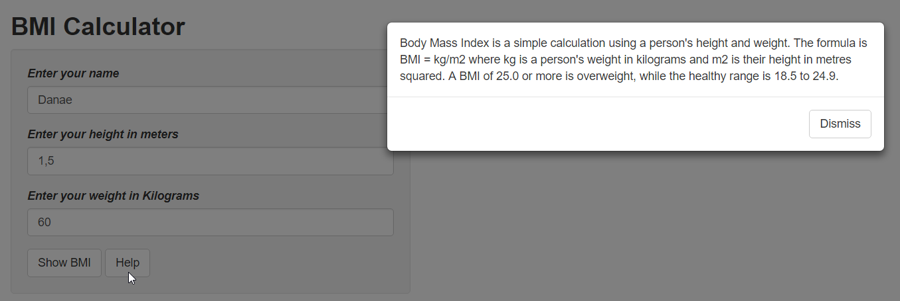

# Shiny Apps

## Exemples of web applications and interactive dashboards with Shiny 

1. **Alien App (Alien Sightings Dashboard)** - The data shown in this app, comes from [The National UFO Reporting Center (NUFORC)](http://www.nuforc.org/), which is an organization in the United States that investigates UFO sightings and/or alien contacts.
This app allows users to select a U.S. state and a time period in which the sightings occurred.

2. **BMI App (Body Mass Index calculator)** - Sometimes you want to perform an action in response to an event. For example, you might want to display a notification or modal dialog, in response to a click. The `observeEvent()` function allows you to achieve this. It accepts two arguments:

   - The event you want to respond to.
   - The function that should be called whenever the event occurs.

This app compute the BMI by receiving the heigth and weigth of the user and shows an example of the `observeEvent()` function.  

3. **Popular baby names App** - This app lets the user choose the sex and the year, and will display the top 10 most popular names
in that chosen year. The showed plot has been buil with the `plotly` package and the table uses the `kableExtra` package.  

4. **Customizable plot** - Customize the size of the points, the color of the points, the plot title, axis labels, etc. 
This app uses the `colourpicker` package to let you select any color in your plot, as well as somme special `shinyWidgets`. 
The second panel allows the user to explore the data frame using the interactive package `TD` and some customized function 
from CSS. 

5. **The shooting app** - This app uses the data from 
[Mother Jones](https://www.motherjones.com/politics/2012/12/mass-shootings-mother-jones-full-data/)
, a non-profit organization that registers several information about shootings in the USA. This app 
displays a map identifing the areas where the shooting took place by date and number of fatalities. 
The r package `leaflet` has been used to display the map. 